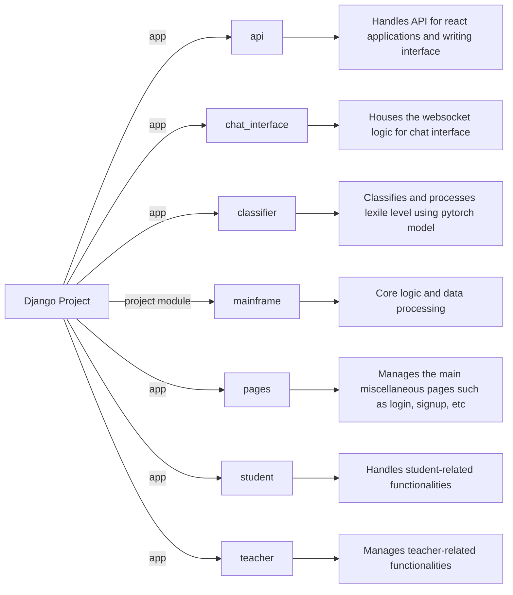
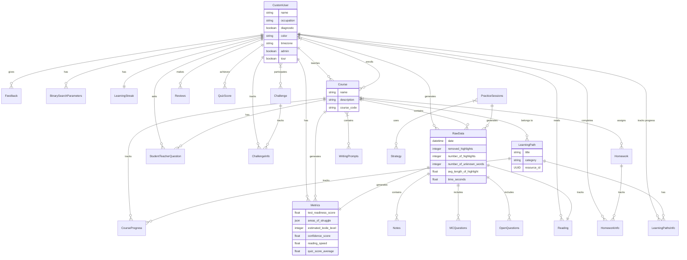

# YouCademy

An English-learning web platform for students and teachers. Students read texts matched to their reading level, practice writing and speaking, and review vocabulary; teachers manage courses and follow student progress.

> **Portfolio project.** This repository is a snapshot of a project I built in 2024-2025. It is not deployed, and the cloud services it used (GCP project, API keys) have been shut down or revoked. You need your own API keys to run the AI features (see [Getting Started](#getting-started)).

## Features

- **Level-adaptive reading:** a PyTorch model estimates the Lexile level of a text, and the app uses OpenAI to simplify or adapt texts to the student's level.
- **Learning paths and homework:** teachers assign courses, learning paths and homework; students work through them and their progress is tracked.
- **Writing editor:** a Notion-style React editor with AI feedback and writing metrics.
- **Flashcards:** a React flashcard app with a spaced-repetition algorithm.
- **Quizzes:** auto-generated comprehension quizzes with AI grading, where the score feeds back into the student's level.
- **Pronunciation practice:** speech recordings scored with the SpeechSuper API, plus text-to-speech.
- **Real-time chat:** a WebSocket chat interface (Django Channels + Redis) with an AI assistant.
- **Auth:** email, Google and Microsoft sign-in (django-allauth), with English and Dutch translations.

## Tech stack

| Layer | Tools |
|---|---|
| Backend | Python 3.11, Django 4.2, Django REST Framework, Django Channels (Daphne) |
| Frontend | Django templates, React (TypeScript) apps in `reactapps/` |
| Data | SQLite (local) / PostgreSQL (prod), MongoDB, Redis |
| AI / ML | OpenAI API, Groq, PyTorch (Lexile classifier) |
| Cloud | Google Cloud Run, Cloud Storage, Pub/Sub, Cloud Tasks, Cloud Build, Docker |

## Django Project Diagram



## Architecture


### Scaling

[Scaling](doc/scaling.md) documentation.

## Getting Started

Requires Python 3.11, Redis, and a MongoDB connection string (a free MongoDB Atlas cluster works).

### 1. Configure environment variables

```bash
cp .env.example .env
```

Fill in `SECRET_KEY` and `MONGO_URI` at minimum. The AI features need your own `OPENAI_KEY` and `GROQ_API_KEY`; pronunciation scoring needs SpeechSuper keys. Features whose keys are missing will not work. The `.env.example` file documents every variable.

### 2. Install Redis

```bash
brew install redis
redis-server
```

### 3. Install requirements from requirements.txt

```bash
python -m venv venv && source venv/bin/activate
pip install -r requirements.txt
```

### 4. Create the database and collect static files

```bash
python manage.py migrate
python manage.py createsuperuser
python manage.py collectstatic
```

> Some third-party theme assets (the `themes/` folder and part of `static/`) are not included in this repository for licensing reasons, so some pages may look different or be missing images.

### 5. Run Server

#### To run without chat

```bash
python manage.py runserver
```

#### To run with chat

```bash
daphne -p 8000 mainframe.asgi:application
```

### To update React Apps

- do npm run build in the respective app folder and then copy the name of the js file and and paste it in the respective html file in the templates folder.
- Similarly do the same for the css file which goes into the writing_layout.html file in the base templates folder.
- Then do collectstatic to collect all the static files in the static folder.

```bash
python manage.py collectstatic
```
### Important files:
- mainframe/settings/local.py: Settings file for local development
- mainframe/cloudstorage.py: Configuration for second cloud storage buckets for uploads. Important for deploying changes to any uploads to GCS in production.
- mainframe/middleware.py: Sets up url for websocket and redirects if youcademy is accessed from www.youcademy.dev.
- mainframe/adapters.py: Has exact procedure on adding users from google or microsoft login.
- All urls.py: Contains information on which views file contains the views for a particular endpoint.
- chat_interface/consumers.py: Contains the logic for the websocket for the chat interface using react.
- reactapps/chatreact/src/components/page.tsx: Contains all the logic for the chat frontend.
- reactapps/frontend/src/App.tsx: Contains the logic for the notion-style editor in the writing part of youcademy.
- reactapps/flashcards/src/App.js: The logic for the flashcards with the spaced repetition algorithm.
- classifier/apps.py: Lexile predictor model that is running in the background.
- pages/context_processors: Whenever you want to "inject a global variable" to every django html templates code, you can define it in the dictionary and it will be added
- pages/forms.py: Contains form for populating adding a student to a course, adding a practice session as a teacher and form for reading strategy.
- pages/models.py: Contains the object models for the django ORM.
- utils/helpers.py: Contains most of the logic for calls to OpenAI API.
- utils/dicts.py: Contains information on the mappins between lexile levels and CEFR levels, as well as the detailed writing and question metrics.
- utils/translations.json: Contains the dutch and english translations for home.html and other misc non-login required pages.
- Dockerfile: contains info on how the container is being built and ran,
- entrypoint.sh: contains the command ran to run the container once built.
- cloudbuild.yaml contains the specs on how to do the cloudbuild build.

## Relational Model Diagram

